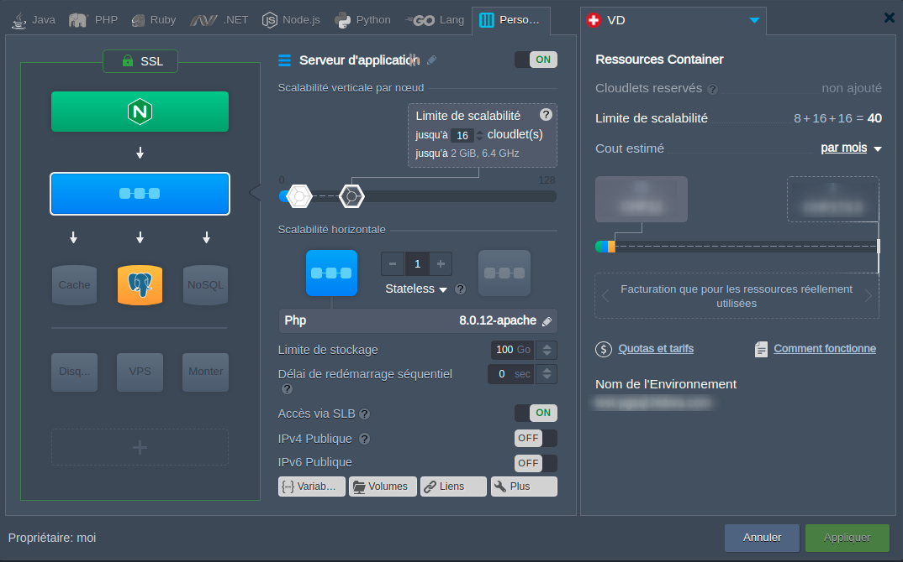

# Symfony-Jelastic

This JPS package (for Jelastic) provides a standard environment for your Symfony projects.



## How to use ?

- Import this manifest in your Jelastic: ```https://raw.githubusercontent.com/yoanbernabeu/Symfony-Jelastic/main/manifest.jps```
- If you want, install Node and NPM
- Choose between MySQL or PostgreSQL
- Delete the example directories: /var/www/public and /var/www/html
- Clone and install your project in /var/www
- Have fun !

## Features

- Apache2 with PHP 8.1 (Node and NPM in option)
- 1 MySQL 5.7 or PotsgreSQL 12
- 1 load balancing server (NGINX)